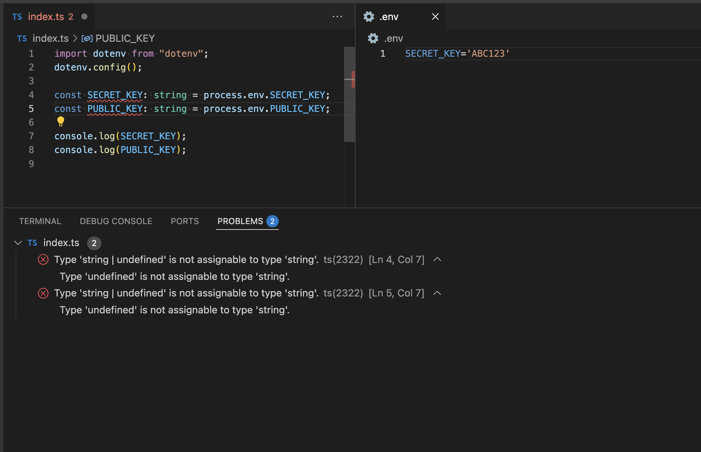
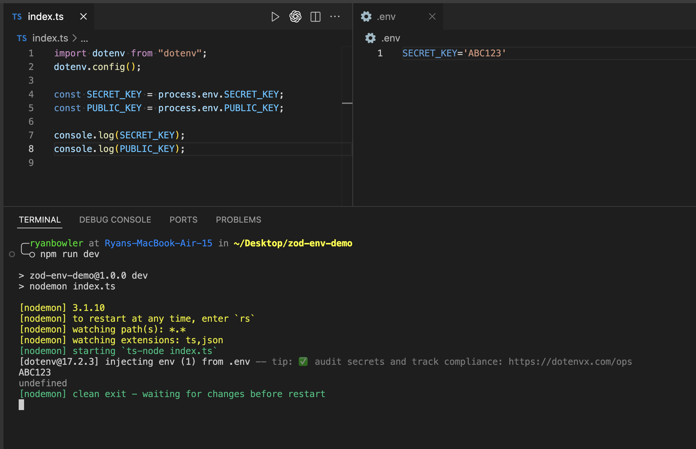
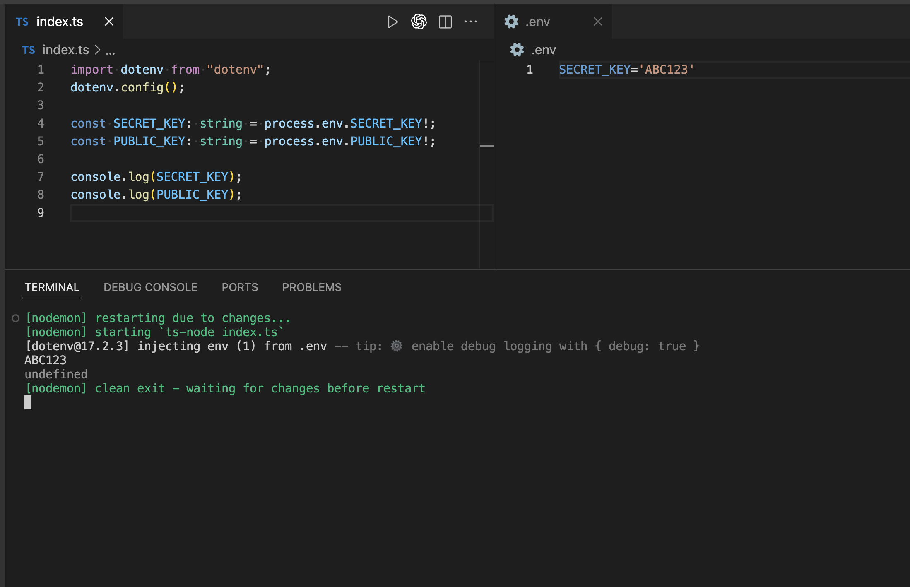
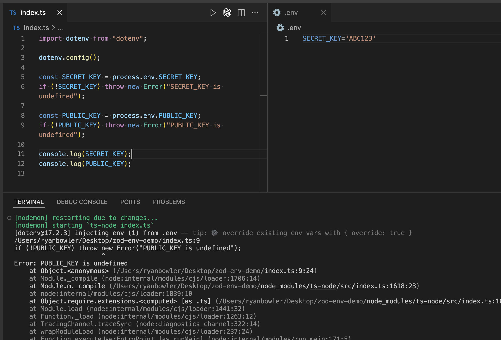
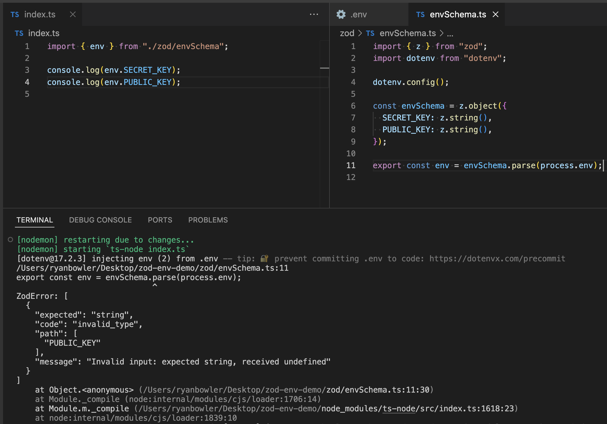
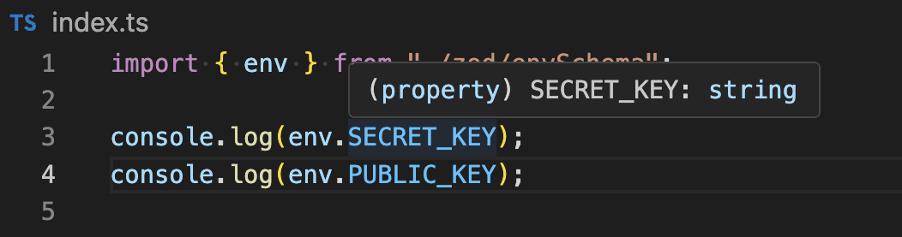
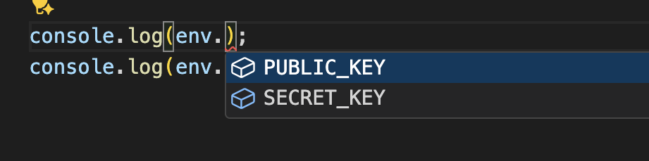
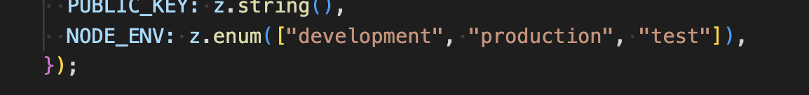

# Schema Therapy for Your Environment Variables

_By Ryan Bowler - 05/11/2025_

## What's the problem?

Environment variables, we all use them, and we all forget about them. One day they're there, the next they're not (you forgot to add them again) and suddenly your app’s throwing errors that make no sense. Undefined values creep in, things break in mysterious ways, and TypeScript just shrugs. Debugging problems can eat hours of time, all because your environment wasn’t as safe as you thought, let's explore how we can solve this.

In my setup below, I have only one key-value pair in my .env file. In my index.ts file, I’m trying to pull in 2 env variables and type them to “string”. This causes me 2 problems:

1. TypeScript is shouting at me that I can't assign the type “string” because the env variable could also be “undefined”.
2. When I run the code, the second console.log() will print “undefined” …because it is.

Now imagine “undefined” being passed around with no visibility or warning about the fact. Definitely not fun, and will lead to some confusing errors.

## Solutions

### Non Null Assertion (!) - Bad Solution

If all you want is to silence the TypeScript error, you might be tempted to reach for a “trust me bro” assertion. Whilst it succeeds at that, it still has the same undefined risk as before. This doesn’t solve our problem.

### If Checks - Okay Solution

Okay now we’re getting somewhere, this checks for undefined at runtime and throws descriptive errors. Not only that, but it also types the env variables to “string” after the if check. This solution is pretty good, it does what we want, nothing more, nothing less, like a Toyota Corolla type solution, ...but don’t we deserve more than that???

### Zod Schema Validation - Great Solution

Welcome to the Zod validation club, can I take your coat? Would you like a drink? Complimentary, of course…

This solution is what I’d imagine riding in a Bentley feels like, robust and premium. With Zod validation, your app fails fast during initialisation if an env variable is missing or invalid. This can save you from a lot of painful debugging.

I love that your Zod schema becomes the single source of truth for what configuration your app expects. It validates both value and type at runtime, giving you descriptive errors and peace of mind. You still use dotenv to load your environment variables, but then pass them through a Zod schema to validate and type them. Parse them, export them, import them, and use them… simple!

- TypeScript typing for env variables

- IDE auto-completion for env variables in the schema

- You can even add more advanced schema/type checks, for example an enum for NODE_ENV

I hope you learned something about schema validation and what it can do for your env variables.

See you next time 👋

---

### Inspiration:

Thanks to Christian Nwamba for inspiration for this post.

[Watch the video that inspired this post](https://www.youtube.com/watch?v=eZBsBMf5zuQ)
